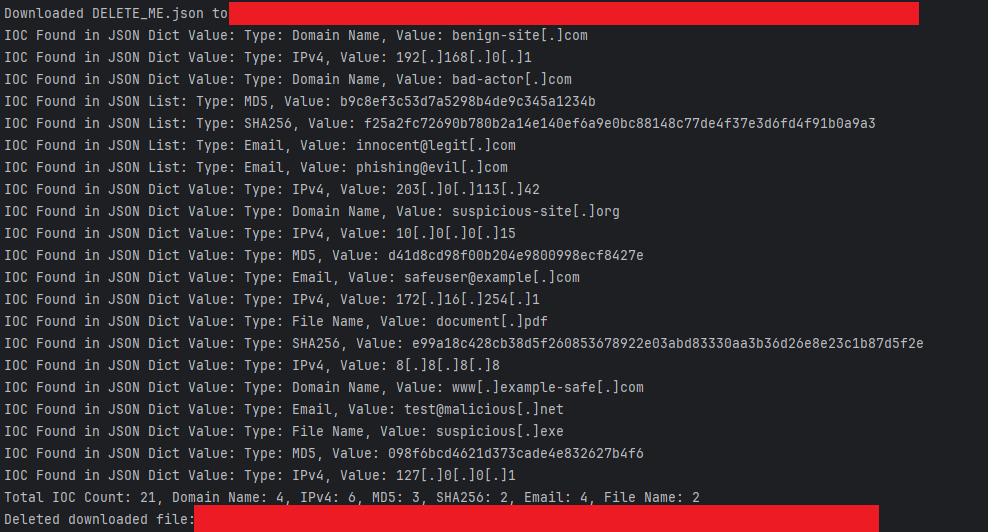
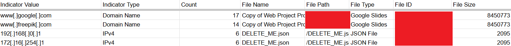

# GDIOCSpider

**GDIOCSpider** is an open-source, configurable, Python Incident Response (IR) and Security Research tool specifically
catered around
IOC extraction and identification in GDrives with poor data context. Taken as an end-to-end application, this tool
crawls through a
provided GDrive, extracts IOCs from all files
processed, and outputs found results into a CSV file for research, analysis, and identification.

This tool comes complete with the standalone IOCFlagger package, which can be used in isolation to type IOCs purely
from their value, if a GDrive crawler is not your needed use-case but IOC enrichment and extraction is.

The tool supports a variety of file types, as well as ioc types. It's relatively simple, clean, efficient, and fast.

If you see something you'd like changed, please submit an Issue or better yet a Pull Request. I look forward to your
feedback.
This is an Open Source tool, so nothing I would love more than feedback or collaboration!

# Setup

Unfortunately, everything using the GDrive API requires the creation of a GCP Application in addition to either OAuth
enablement or a
Service Account in GCP

1. Go to the Google Cloud Console.
2. Create a new project and enable the [Google Drive API](https://support.google.com/googleapi/answer/6158841?hl=en).
3. Either configure OAuth for
   a [personal account](https://console.cloud.google.com/apis/credentials/consent?pli=1&inv=1&invt=AbnkuQ&project=just-skyline-231218) (
   Recommended) and get credentials.json. Or Create a service
   account [using the steps here](https://developers.google.com/workspace/guides/create-credentials). You likely already
   have this if you are involved in the GCP ecosystem and get token.json.
4. Clone this repo
5. In the Root Directory, place your token.json file and credentials.json file (or potentially just your token.json if
   using a service account)
6. Examine `settings.py` for all settings. See if there's anything you want to change in `config.json`.
7. Install with your choice of tool, i.e: `pip install ./GDIOCSpider`
8. Run with required parameters: `gdiocspider --config_file="/tmp/config.json" --output_file="/tmp/indicator_data.csv"`
9. This will require authorization of your custom application on first run

# Supported IOC Types

In the current version of IOCTyper, the following IOC Types are supported:

- IPv4
- IPv6
- SHA512
- SHA256
- SHA1
- MD5
- Email
- Registry Key
- User Agent
- Domain
- File Name
- File Path
- Keyword

# Support File Types

The current version of the GDIOCSpider accommodates all the following file types:

- Text File
- CSV File
- PDF File
- JSON File
- Google Slides
- Google Docs
- Python Script
- Google Sheets

# Explanation of Settings

`settings.py` Is complete with an explanation of all the configuration settings and their default. The goal of this
tool is to offer the flexibility for you to accomplish your needs in the way you see fit.

`config.json` Is what you actually modify to change how the code will run, `settings.py` serves as documentation
